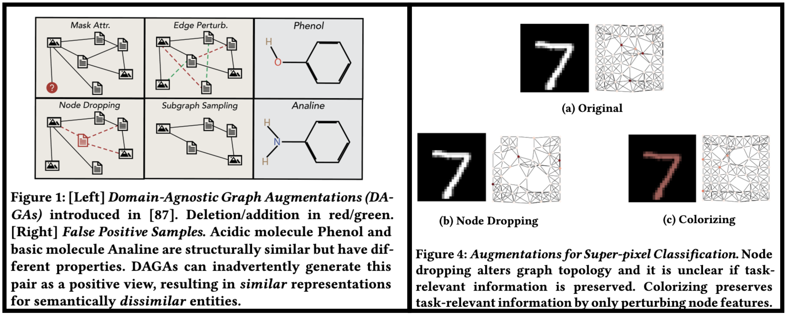

# ["Augmentations in Graph Contrastive Learning: Current Methodological Flaws & Towards Better Practices"](https://arxiv.org/abs/2111.03220)



## Requirements
This code uses: 
```
- python 3.8
- torch 1.11.0
- torch-geometric 2.0.4
- PyGCL 0.1.2
```


## Source Code
⚠️ This repository is still under construction. However, we provide some key files here.

- `datasets_mnist.py`: provides implementations for the node dropping and colorizing augmentations.
- `run_BYOL.py`: contains code for running the BYOL on MNIST using either the node dropping or colorizing transforms. 
- `examples/compute_invariance_sep.py`: given a trained checkpoint, compute invariance and separability scores. See `run_compute_invariance.sh` for an example.
### Acknowledgements
This code is inspired by and makes us of several great code bases. We especially thank the authors of [PyGCL](https://github.com/PyGCL/PyGCL), [GraphCL](https://github.com/Shen-Lab/GraphCL), [AD-GCL](https://github.com/susheels/adgcl), [EDA](https://github.com/jasonwei20/eda_nlp), and [Benchmarking GNNs](https://github.com/graphdeeplearning/benchmarking-gnns).
